# CPS-272 — Architecture & Diagrams (Mermaid)

All diagrams are Mermaid — they render in GitLab/GitHub/VS Code. Source of truth for flows in `01-TDD-main.md`.

---

## As-Is vs To-Be — visual comparison (read first)

Same visual grammar in both charts: rounded boxes are entry points, diamonds are decisions,
loop-backs show rework. The table below maps each stage.

**AS-IS — assisted registration (today):**

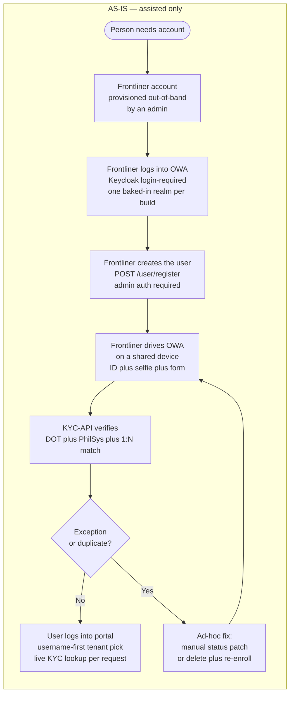

**PROPOSED — self-service (this design):**

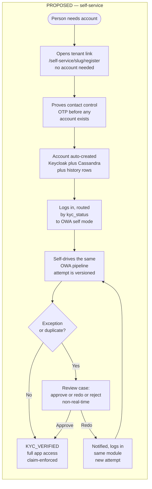

**Entry-point contrast (how tenant is known):**

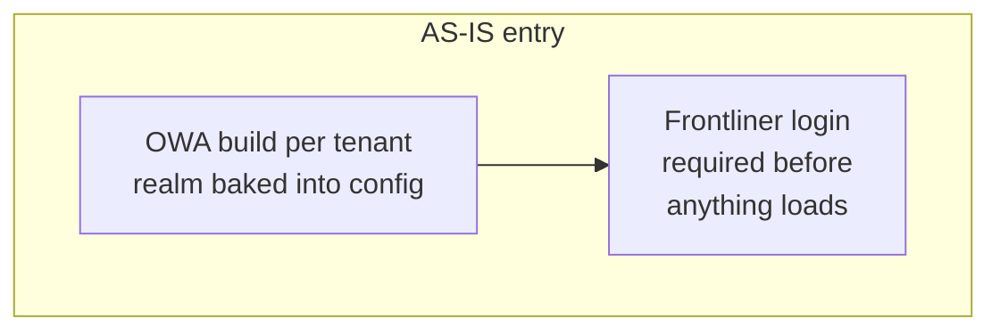

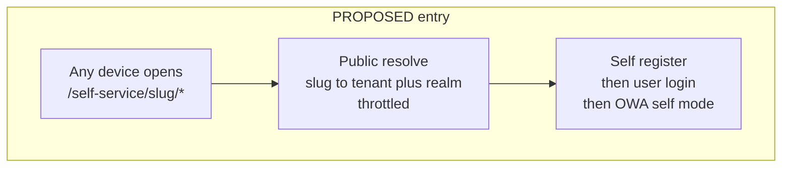

### Stage-by-stage diff

| Stage | As-Is | Proposed | What changes (ticket) |
|---|---|---|---|
| Tenant identification | Baked-in realm per OWA build; portal resolves tenant from username (needs account) | Slug-first public resolve, no account needed | A-01 |
| Account creation | Admin/frontliner calls authed `POST /user/register`; bulk import | Pending record plus OTP, account auto-created only after verify | A-02, A-03, A-04 |
| Contact proof | None for new users (trusts frontliner) | OTP single-use + TTL before creation | A-02, A-03 |
| OWA access | Frontliner Keycloak login, shared device | End-user Bearer, own device, runtime tenant | C-01 |
| Applicant binding | None (counsellor-attributed) | `applicant.self_user_id` bound, idempotent resume | C-01, C-03 |
| Verification pipeline | DOT + PhilSys + 1:N, assisted capture | Identical pipeline, self capture | C-02 (reuse) |
| Exception handling | Ad-hoc status patch or delete + re-enroll | `review_case` + back-office adjudication (PENDING on hits) + approve/redo/reject, attempts immutable | D-01, D-02, D-02b, D-03 |
| Redo | Manual rework by staff | Notify user, same module, new attempt | D-04 |
| KYC gating | Portal hides tiles; live KYC lookup per request | Attribute + `kyc_verified` claim, materialised status, triple enforcement | B-01, B-02 |
| Audit trail | Request logs + `audit_trail` only | Plus append-only `user_lifecycle_history` with attempt linkage | D-07 |

---

## 1. C4 Context — Self-service in the existing ecosystem

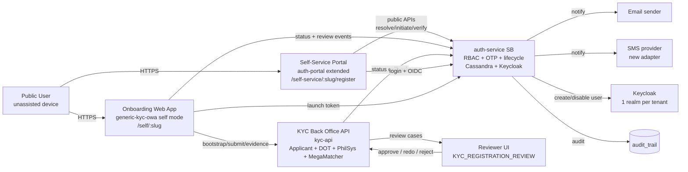

## 2. Container view — auth-service internals (new in bold)

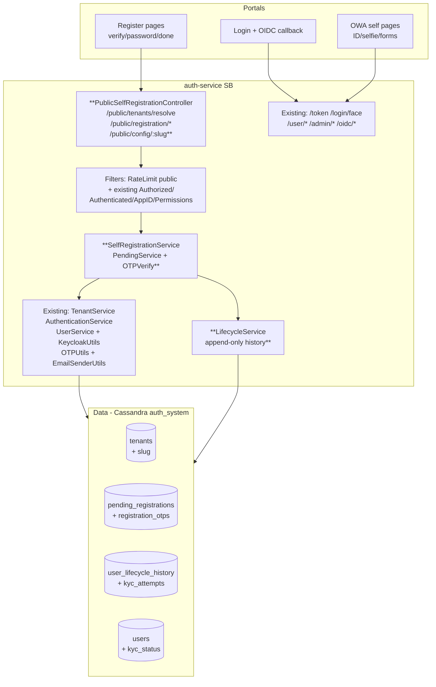

> New tables: `pending_registrations`, `registration_otps`, `user_lifecycle_history`, `kyc_attempts` (+ `users.kyc_status` etc.). Full DDL in `04-data-model.md`.

## 3. End-to-end user journey (two steps)

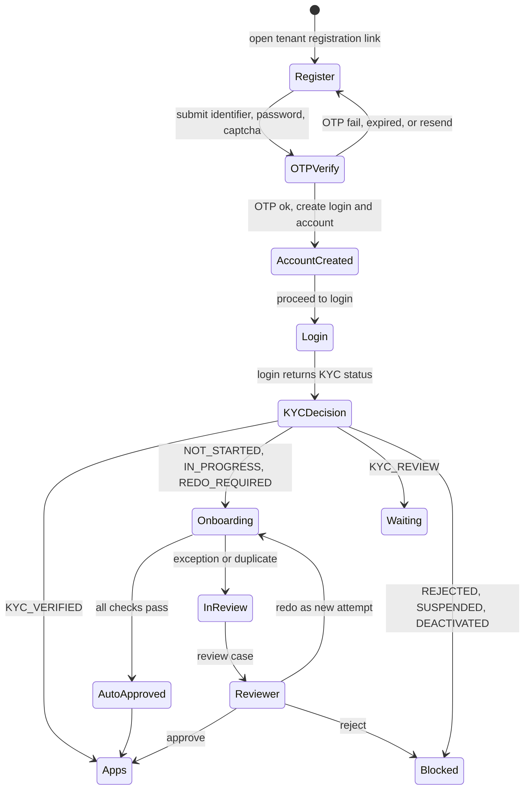

## 4. Sequence — Step 1 self-registration (OTP before account)

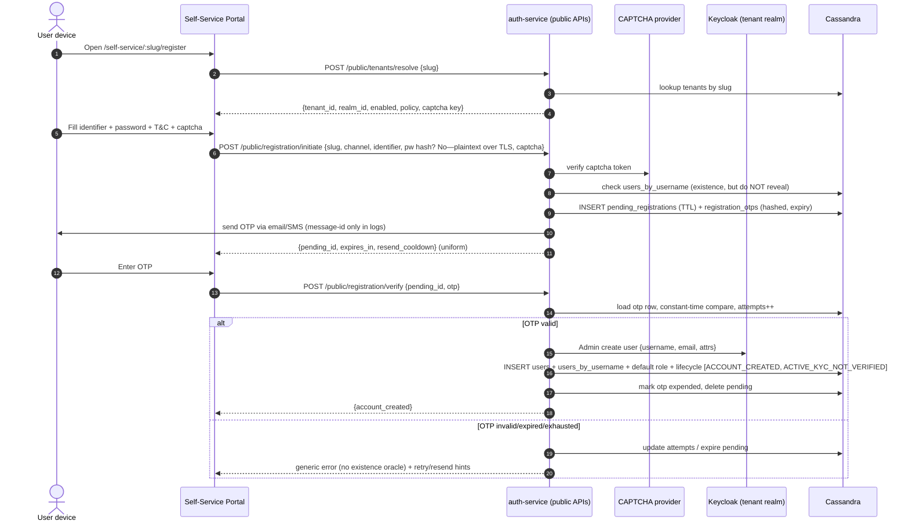

Key points: no `users` or Keycloak row before OTP success; uniform responses; every step audited; rate limits by identifier + IP (see `06`).

## 5. Sequence — Tenant-aware login + KYC decision

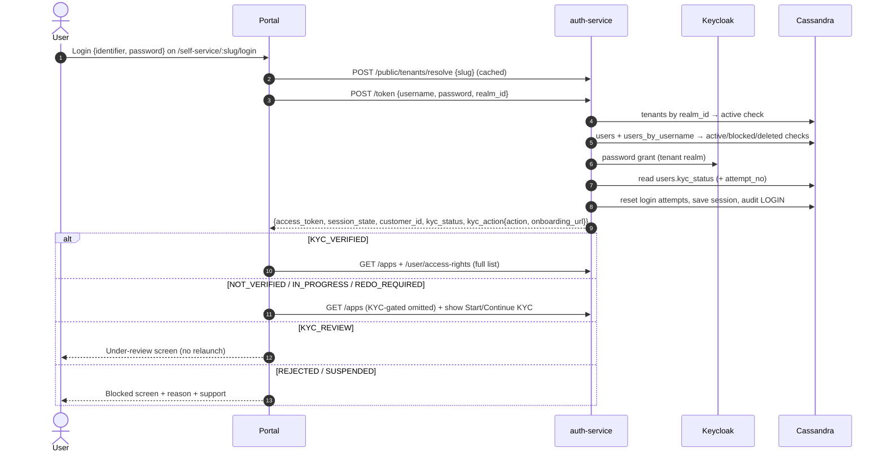

OIDC apps receive `kyc_verified` + `kyc_status` claims in `id_token` (see `03 §3.3`) so direct API calls cannot bypass the portal.

## 6. Sequence — Step 2 KYC onboarding (self mode, PhilSys + 1:N)

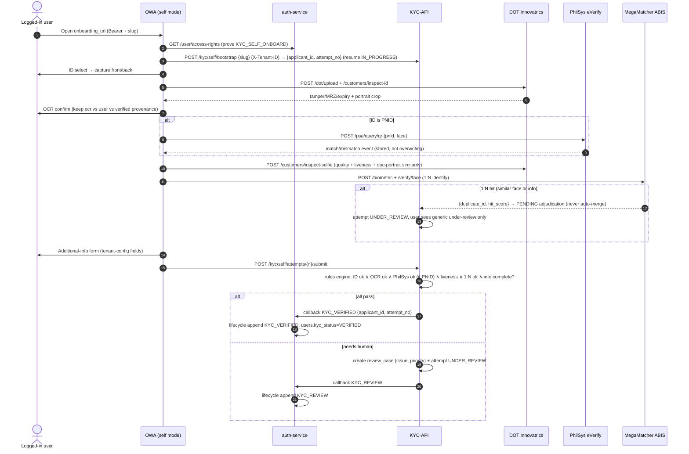

## 7. Sequence — Review (approve / redo / reject) + re-onboarding

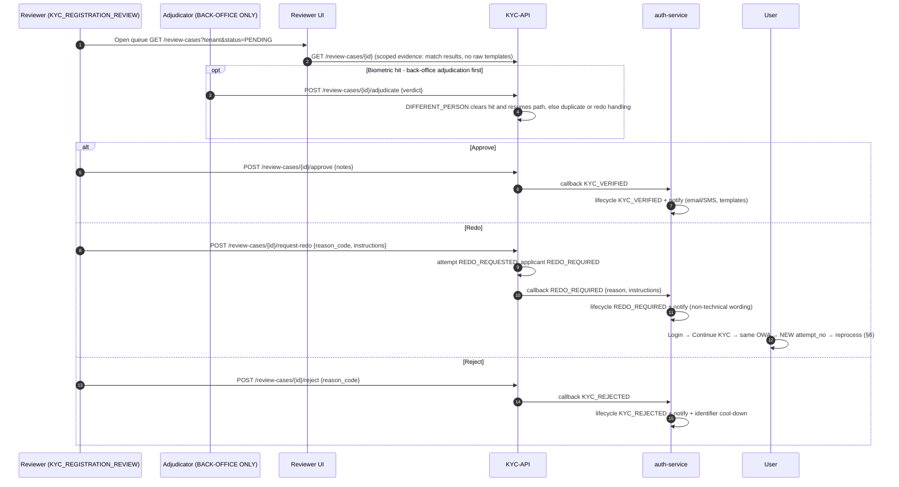

## 8. State machines

### 8.1 KYC status (auth materialised view; HLR §18 overall status)

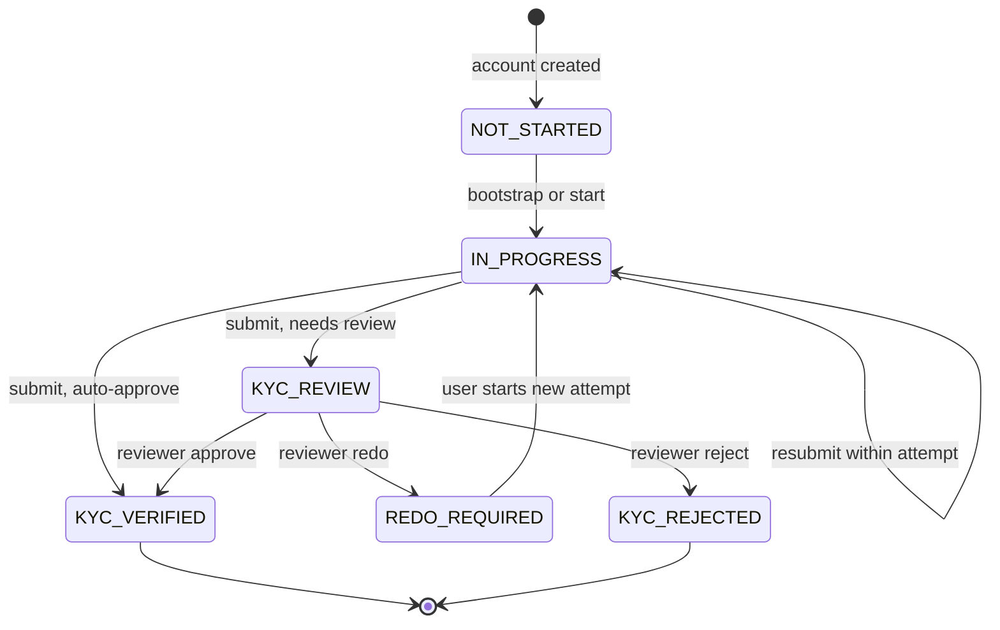

### 8.2 Attempt status (per onboarding submission; HLR §18)

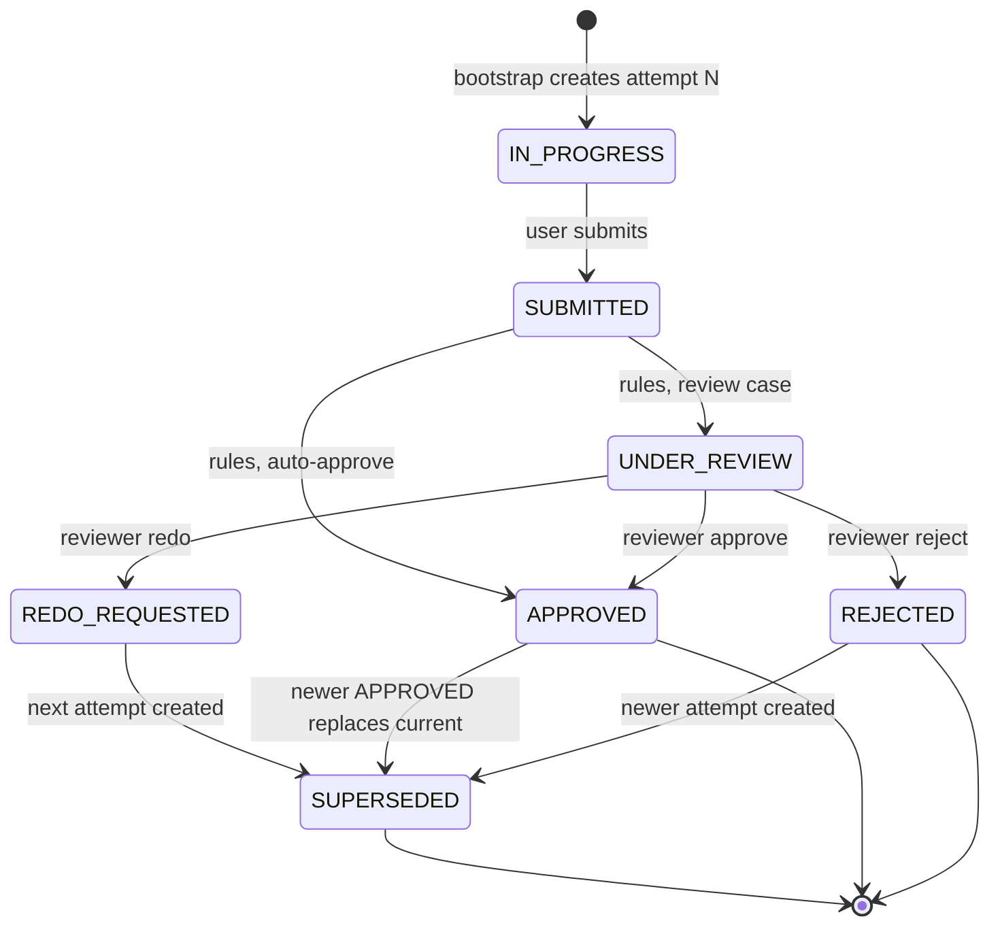
\* Superseded `APPROVED` rows are retained for audit; "current" = latest `APPROVED`.

### 8.3 Review-case status

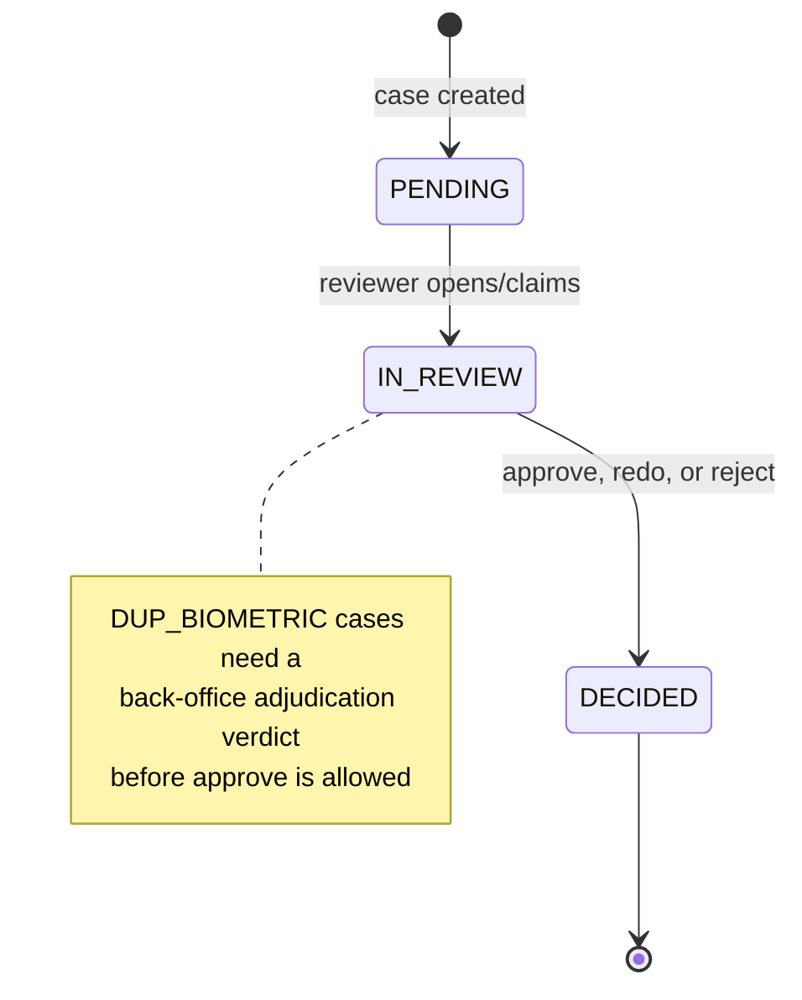

## 9. Deployment / network sketch (logical)

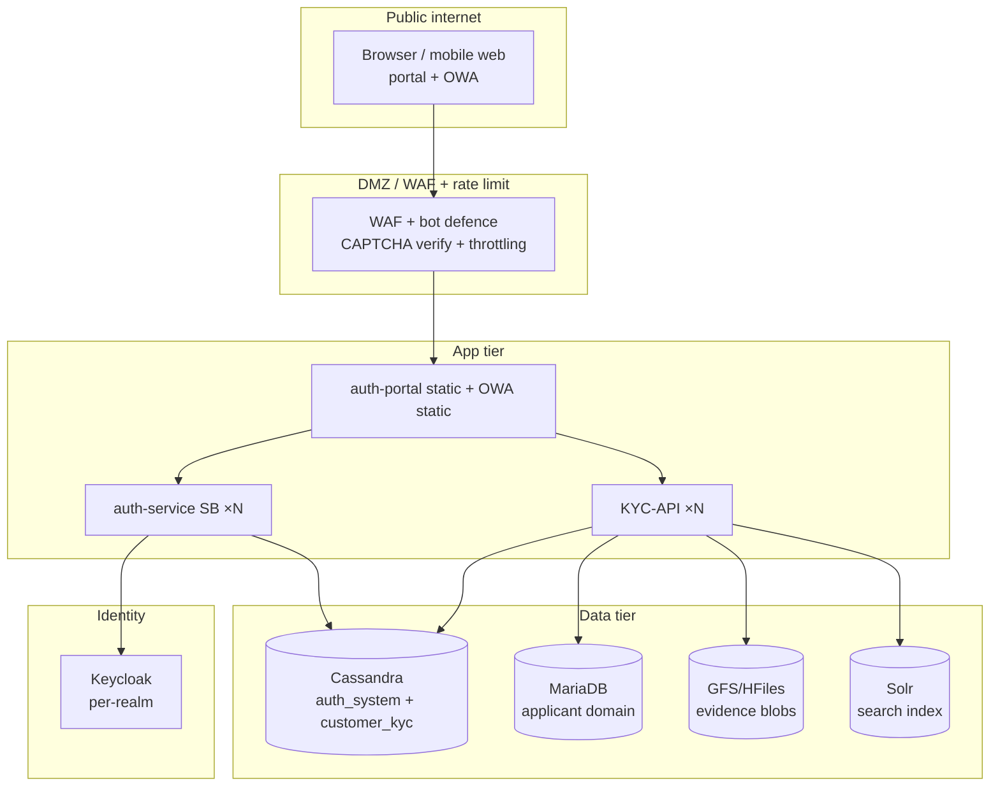
