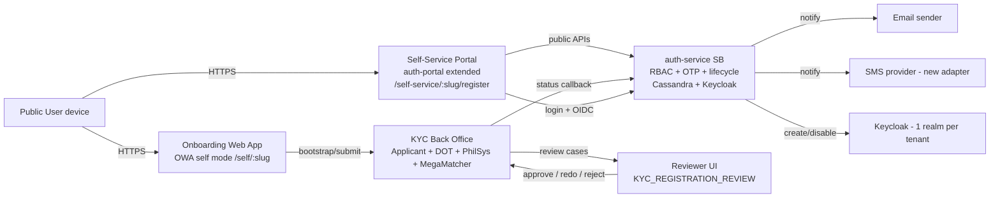
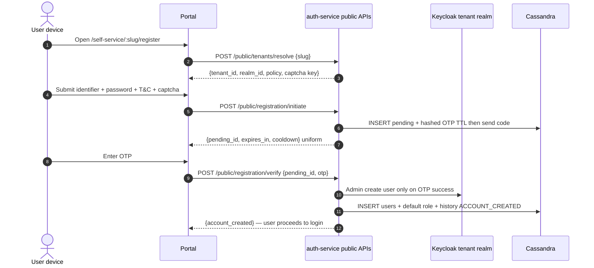
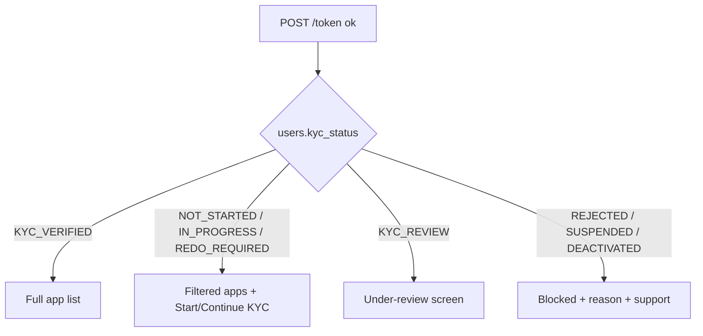
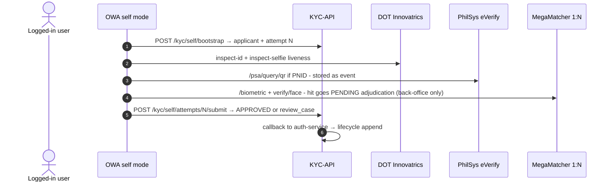
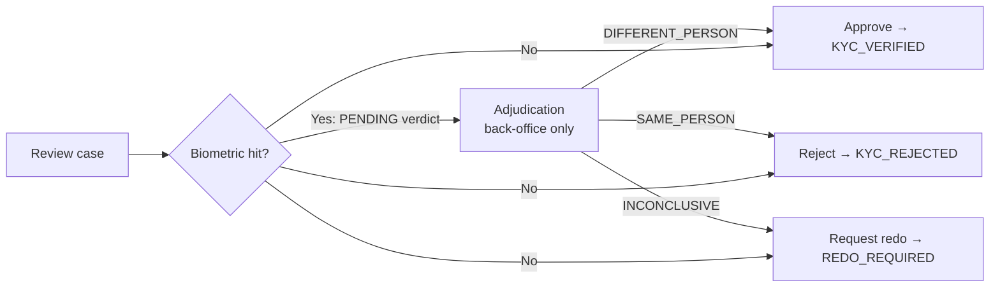
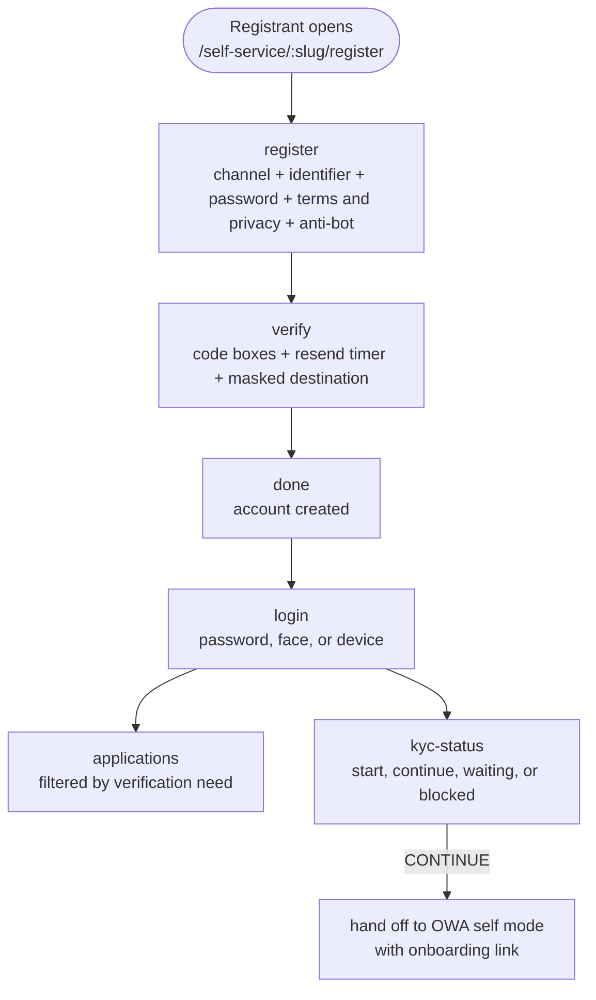
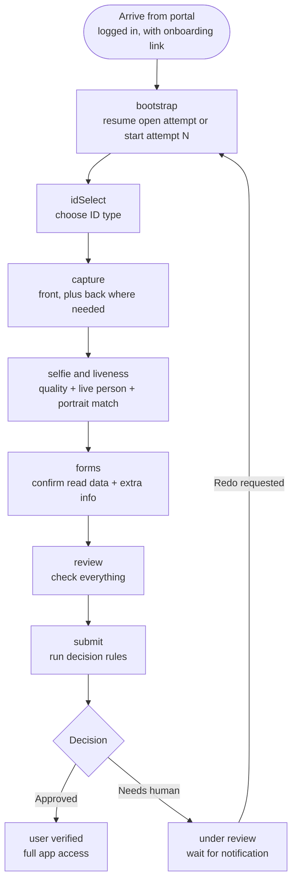
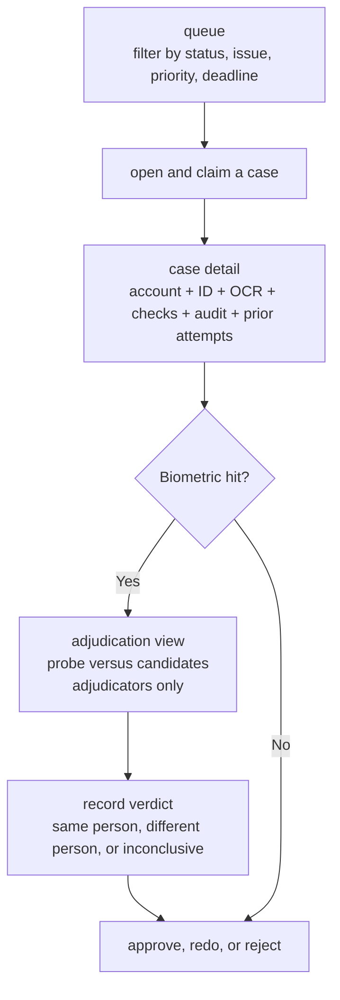
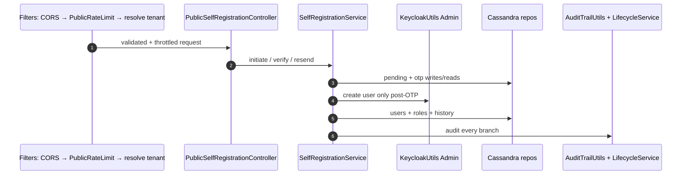

# Self-Service User Registration with KYC Integration — Technical Design

> **Template compliance:** this document follows the team TDD template section-for-section
> (Executive Summary → Appendix). One numbering fix: the template labels both *Goals & Non-Goals*
> and *Proposed Solution* as "§3" — here Proposed Solution is §4 and subsequent sections shift by one
> so numbering is sequential. Section titles are unchanged.
> Detail annexes: `01-TDD-main.md` (design rationale), `02-architecture-diagrams.md` (full Mermaid set),
> `03-api-design.md` (contracts), `04-data-model.md` (schemas), `05-user-stories-tickets.md` (Jira-ready tickets),
> `06-security-errorhandling.md` (threat model + error catalogue), `07-glossary.md` (term definitions),
> `08-use-cases.md` (end-to-end scenarios with ticket coverage), `09-rollout-plan.md` (phases, decisions, checklists).

**Title:** CPS-272 — Self-Service User Registration with KYC Integration

**Author(s):** Auth Team (drafter: Kevin Vega — confirm)

**Status:** Draft

**Reviewers:** Lead Developer / TL, Solution Architect, Security Team, KYC Back-Office owner

**Last Updated:** 2026-09-14

---

## 1. Executive Summary

Today, user onboarding is assisted-only: a frontliner with an RBAC account creates users via an
authenticated `POST /user/register` and drives the Angular onboarding app (`generic-kyc-owa`) on a shared
device, with one Keycloak realm baked in per deployment. This project adds a tenant-scoped self-service
path so any person can register their own account with a verified email/mobile (Step 1 proves contact
control via OTP before any account exists), then complete identity verification in the same KYC module
unassisted (Step 2 proves personhood via ID/OCR, PhilSys eVerify for PNID, liveness and 1:N biometrics),
with exceptions handled in a non-real-time reviewer queue (approve / request-redo / reject). KYC status is
enforced as an authorization attribute alongside roles/permissions, backed by an immutable lifecycle
history and versioned onboarding attempts. Expected outcome: pilot tenants can onboard users without
frontliner assistance while reusing the existing auth-service, KYC back office, and RBAC with additive-only
changes and no standby redesign of the verification algorithms.

## 2. Context & Problem Statement

### Context
What is the background of this project? What systems are currently in place?

| System (repo) | Role today | Key facts for this design |
|---|---|---|
| auth-service SB (`svi-authentication-springboot-kyc`) | RBAC + auth source of truth. Spring Boot 4.0.5 / Java 25, Cassandra `auth_system`, 1 Keycloak realm per `tenants.realm_id`, context path `/spring/auth-services` | `POST /user/register` requires `@Permissions + @Authenticated + @Authorized` (admin/frontliner only — no public path). Login `POST /token`, face login `POST /login/face`, OIDC provider (`/oidc/*`, `svi_session` cookie). OTP (`totp` table, HMAC-SHA256) exists only for forgot-password; SMS send stubbed. `users` has `is_active/is_deleted/is_blocked` + `applicant_id/linked_person_id` but no KYC state. `GET /apps` + `GET /user/access-rights` already skip `requiresKYC && !verified` via live KYC lookup |
| Onboarding web app (`generic-kyc-owa`, Angular 16) | Assisted KYC capture: ID select → capture → selfie → biometrics → form → `POST /kyc/submit/hfiles`, `POST /biometric`, DOT Innovatrics inspect, PhilSys `/psa/query/qr`, MegaMatcher 1:N | Boots Keycloak `login-required` on a single baked-in realm; no tenant headers/params; multi-tenancy = rebuild per tenant; no applicant self-bootstrap; contact-info page local-only |
| KYC back office (`kyc-api`, Jersey/Java 8; `svi-kyc-api-springboot-kyc` skeleton) | Verification + evidence store (MariaDB + Cassandra + Solr + GFS/HFiles + MegaMatcher + DOT + eVerify) | `Applicant{applicant_id, tenant_id, application_status, current_workflow_status, kyc_verification_result}` + `GET /status`; no first-class review-case resource and no approve/redo/reject transitions |
| Auth portal (`svi-authenticationportal-react-kyc`, React 19) | Login + app dashboard; OIDC code+PKCE; tenant picked post-username via `POST /tenant {username}` | No `/register` route; `userEndpoints.register` templates exist but have no callers |

Full evidence in `01-TDD-main.md §2`. For a side-by-side visual of current vs proposed,
see `02-architecture-diagrams.md` ("As-Is vs To-Be — visual comparison").

### Problem Statement
What is the specific pain point or gap being addressed?

1. **No unassisted path:** every account needs a provisioned frontliner and a per-tenant OWA build — blocks scale to millions of self-registrations (gap G-01/G-05).
2. **Tenant cannot be identified before an account exists:** username-first resolution fails for brand-new users (G-02).
3. **Verification-before-creation is missing:** OTP is scoped to existing users; nothing prevents unverified account creation if a public register were naively opened (G-03/G-04).
4. **KYC has no lifecycle system-of-record:** no `kyc_status`, no immutable history, no attempt versioning, no review state machine — audit/compliance/redo cannot be built correctly (G-04/G-06).
5. **KYC gating is a per-request live lookup:** latency + outage coupling on the login hot path (G-07); SMS/CAPTCHA/rate-limit gaps remain (G-08).

## 3. Goals & Non-Goals

### Goals — what success looks like
| ID | Goal (measurable) | Maps to |
|---|---|---|
| G-01 | Public registration for whitelisted tenants: `resolve → initiate → verify → login` E2E < 2 min happy path, OTP delivery p95 < 30 s | FR-01…FR-04 |
| G-02 | Zero unverified accounts: no `users`/Keycloak row exists before OTP success (verified by test query) | FR-03/FR-04 |
| G-03 | Same KYC module for assisted + self: assisted E2E regression stays green; self reuses DOT/PhilSys/MegaMatcher pipeline unchanged | FR-13…FR-21 |
| G-04 | Reviewer SLA operability: every exception becomes a triageable case with approve/redo/reject; redo returns via same module as a new attempt, prior attempts immutable | FR-22…FR-33 |
| G-05 | Enforcement without UI trust: KYC-gated API denied with `kyc_verified=false` even bypassing the portal (negative test) | FR-09 |
| G-06 | Audit completeness: golden-path journey reproduces the HLR §3 nine-row history with attempt linkage | HLR §3/§21 |
| G-07 | Additive-only change: no breaking change to existing endpoints/tokens; rollback = disable per-tenant flag | DoD |

### Non-Goals — intentionally out of this phase
- Redesign of OCR/liveness/biometric/PhilSys matching internals (reused as black boxes).
- BPO work-item engine redesign (lifecycle history is system-of-record; BPO used only for reviewer assignment — see `01 §10.3`).
- Native mobile SDKs / passkeys / magic links (responsive web only; hooks reserved).
- Legacy `svi-authentication-java-kyc` caller migration (parity check is a dependency, DEP-07 in `01 §11`).
- Auto-merge/delete on duplicate biometrics (always a review case — never automatic).

## 4. Proposed Solution (High Level)

A narrative overview of the approach. How does this solve the problem statement without getting into the "weeds" of the code?

Treat onboarding as three owned capabilities — **Account Management** (auth-service) → **Identity/KYC**
(KYC-API + OWA) → **Authorization** (RBAC) — communicating only via versioned APIs and a status callback,
never direct DB access. Tenant is resolved **slug-first** from the entry URL (`/self-service/:slug/register`), before
any username exists, against a new throttled public endpoint; the server re-resolves slug→tenant→realm on
every call and the browser never sees `client_secret` (CPS-164 preserved). Registration creates only a
TTL'd **pending record + hashed single-use OTP**; the Keycloak user and Cassandra `users` row (with default
role and `NOT_STARTED` KYC state) are created **only after OTP verify**, seeding an **append-only lifecycle
history**. Login returns the materialised `kyc_status` plus a start/continue action, and OIDC `id_token`
carries `kyc_verified` so KYC-gated apps deny direct calls too — KYC stays an **attribute, not a role**.
KYC onboarding reuses the existing OWA pipeline in a new `self` launch mode (end-user Bearer, runtime tenant,
self-bound applicant with idempotent bootstrap); each submit is a new **versioned attempt** (old attempts
`SUPERSEDED`, never overwritten). Exceptions land in a **non-real-time review queue** with exactly three
outcomes — approve, request-redo (user notified in non-technical wording, retries in the same module),
reject — each transition mirrored into lifecycle history via an idempotent service callback. Per-tenant
feature flags allow dark launch and instant rollback.

## 5. Architecture & Program Flow

### 5.1 System Architecture

The structural layout of the services, databases, and third-party integrations.

- **New runtime pieces:** `PublicSelfRegistrationController` + `SelfRegistrationService` + `LifecycleService`
  (auth-service); `pending_registrations`, `registration_otps`, `user_lifecycle_history`, `kyc_attempts`
  (Cassandra); `review_case` + `kyc_attempt` + `applicant.self_user_id` (KYC-API); `KYC_SELF_ONBOARD` +
  `KYC_REGISTRATION_REVIEW` permissions; SMS provider adapter.
- **Reused as-is:** Keycloak per-realm model, `OTPUtils` hashing, `EmailSenderUtils`, login/token/OIDC
  mechanics, DOT/PhilSys/MegaMatcher pipeline, `requiresKYC` app/permission flags, dual audit layers.
- Full C4 + deployment sketch: `02-architecture-diagrams.md §1–2, §9`.

### 5.2 Program Flow Schematics

Detailed flow of the main programs: registration (OTP-before-account), login + KYC decision,
KYC pipeline, review/redo. (Full set with state machines in `02-architecture-diagrams.md`.)

**F-01 — Self-registration (OTP before account):**

**F-02 — Login + KYC decision:**

**F-03 — KYC pipeline (self mode, same module):**

**F-04 — Review outcomes:**

### 5.3 Program Delivery Set

The set of programs/services that will deliver results.

| Deliverable (repo) | Purpose | Expected results |
|---|---|---|
| **Service A1 — auth-service public registration** (`PublicSelfRegistrationController`, `SelfRegistrationService`, `PublicRateLimitFilter`) | Tenant resolve, pending + OTP lifecycle, post-OTP Keycloak/Cassandra creation | Uniform public APIs per `03 §2`; no oracle; all events audited |
| **Service A2 — lifecycle + callback handler** (`LifecycleService`, `POST /internal/kyc-status-callback`) | Append-only history, materialised `kyc_status`, idempotent KYC transitions | HLR §3 golden history reproducible; stale events never regress state |
| **Service A3 — KYC review-case + attempt APIs** (`/review-cases/*`, `/kyc/self/*`, rules/queue) | Self bootstrap/submit, scoped evidence, adjudication + approve/redo/reject | Attempt-versioned record; reviewer SLA operable |
| **Module B1 — portal register/verify/done + status pages** (auth-portal `/self-service/:slug/*`) | Step-1 UX per HLR §5 + KYC-aware app list | E2E register→login→KYC CTA on desktop/mobile; accessible OTP entry |
| **Module B2 — OWA self mode** (`/self/:slug`, `SelfBootstrapService`) | Unassisted capture→verify→submit reusing assisted pipeline | Same verification quality assisted vs self; idempotent resume |
| **Module B3 — reviewer queue + case detail** (KYC BO UI) | Triage with match-results-only evidence default | Decisions audited; raw biometrics gated + watermarked |

### 5.4 Inputs / Outputs

Details of program inputs and outputs.

| # | Input (source → program) | Output (program → sink) |
|---|---|---|
| I-01 | `slug` (URL → portal/auth) | Tenant context `{tenant_id, realm_id, policy, captcha key}` (auth → portal) |
| I-02 | Identifier + password + T&C versions + CAPTCHA token (user → auth) | `pending_id` + OTP via email/SMS (auth → user); uniform shape either way |
| I-03 | `pending_id + otp_code` (user → auth) | Keycloak user + `users` row + default role + history rows (auth → Keycloak/Cassandra) |
| I-04 | Username + password (user → auth login) | Tokens + `kyc_status/kyc_action` + filtered apps; `id_token` with `kyc_verified` |
| I-05 | ID images/video + selfie + consent (user → OWA) | DOT/PhilSys/MegaMatcher results + `applicant + attempt N` + evidence refs (OWA → KYC-API) |
| I-06 | Attempt submit (OWA → KYC-API) | `APPROVED` or `review_case`; status callback (KYC-API → auth-service) |
| I-07 | Reviewer decision + reason/instructions (reviewer → KYC-API) | Attempt/applicant transition + lifecycle append + user notification (email/SMS) |
| I-08 | Every mutation (all → audit) | `audit_trail` + `user_lifecycle_history` rows (queryable for support/compliance) |

## 6. Front-End Development

### 6.1 Component Hierarchy & UI Flow

Schematic of program flow for major UI modules (user navigation, state transitions, component relationships).
One diagram per module — they connect through the handoff notes.

**Portal — account and login (`/self-service/:slug`):**

**Onboarding app — verification (`/self/:slug`):**

**Reviewer UI — queue and decisions:**

- Portal pages reuse existing `api.ts`/`auth-fetch.ts` headers, modal/error patterns, `useInlineCss`/`useRenderTarget`
  conventions; new: channel radio, masked OTP destination, resend timer, T&C version display.
- OWA adds a public route + bootstrap service; capture/DOT/biometric/submit components unchanged.
- Reviewer UI: queue table (case/user/issue/priority/status/SLA) + case detail per HLR §16 (account ref,
  ID + OCR with provenance, PhilSys event, liveness, biometric result-only, prior attempts, potential match).
- Full route tables: `03 §4` (portal), `01 §7.1` (OWA modes).

### 6.2 State Management & Data Fetching

- **Portal:** Bearer in-memory only (existing `auth-token.ts`); `tenant_id/realm_id` in `localStorage`,
  PKCE handshake in `sessionStorage`; `resolve` result cached per slug (5 min); `GET /public/config/{slug}`
  `max-age=300`. No PII in storage beyond masked display values. Authenticated reads (`/apps`,
  `/access-rights`) `private, no-store`.
- **OWA:** existing `RegistrationFormService.completeForm: FormData` store retained; bootstrap result
  (`applicant_id`, `attempt_no`, resume point) held in service + `sessionStorage` for resume across reloads;
  evidence blobs uploaded immediately (no long-lived local cache of biometrics).
- **Reviewer UI:** server-paginated queue (`page_size ≤ 50`); case evidence fetched on demand; raw-evidence
  "reveal" is an explicit audited action, never prefetched.

### 6.3 Technical Stack

| Layer | Framework / libs | Styling / misc |
|---|---|---|
| Portal | React 19, react-router-dom 6, Vite 5, `keycloak-js` (legacy path), vitest | Existing CSS modules + inline-CSS hook; WAR build (`base=/portal/`) |
| OWA | Angular 16, Router, Forms, Material 16, `ngx-webcam`, `recordrtc`, `ng-otp-input` (to be wired), `ngx-captcha`/`ng-recaptcha` | Material theme; per-tenant `config.js` flags; WAR build |
| Shared | `window.__SVI_RUNTIME__` overrides, JSON-driven configs (`AuthWebserviceConfig.json`, `pageRoutingConfig.json`) | Hash routing in OWA retained |

## 7. Back-End Development

### 7.1 Program Flow & Logic

Schematic of program flow for major backend modules — path of a request through middleware, controllers, services.

- Filter order for public paths: `AuditLogger → EnabledCORS(strict allowlist) → PublicRateLimitFilter`
  (new; IP + identifier buckets) — deliberately **without** `@Authorized/@Authenticated/@Permissions`.
  Existing order (`Authorized(0) → Authenticated(1) → AppID(2) → Permissions(3)`) is untouched for private paths.
- Callback path: service-credential check (mTLS/service token) → binding validation
  (`tenant/applicant/user`) → lifecycle append + materialised update → notify → `2xx` only after durable write.

### 7.2 Business Logic & Decision Tables

Document all decision tables before starting development.

**DT-01 — Login KYC action (auth-service, after successful credential check):**

| kyc_status | account state | Action | onboarding_url? |
|---|---|---|---|
| KYC_VERIFIED | ACTIVE | `NONE` — full app list | — |
| NOT_STARTED | ACTIVE | `START` | yes (attempt 1) |
| IN_PROGRESS | ACTIVE | `CONTINUE` | yes (open attempt) |
| REDO_REQUIRED | ACTIVE | `CONTINUE` | yes (new attempt) + reason_code |
| KYC_REVIEW | ACTIVE | `WAIT` — no relaunch | — |
| KYC_REJECTED | ACTIVE | `BLOCKED` + support path | — |
| any | SUSPENDED/DEACTIVATED/LOCKED | `BLOCKED` + reason | — |

**DT-02 — Automated KYC decision (KYC-API rules engine):**

| ID valid | OCR ok | PhilSys (if PNID) | Liveness | 1:N clear | Info complete | Output |
|---|---|---|---|---|---|---|
| Y | Y | Y/NA | Y | Y | Y | `APPROVED → KYC_VERIFIED` |
| Y | Y | Y/NA | Y | **N (hit)** | * | `UNDER_REVIEW` + PENDING back-office adjudication (never auto-merge; approve blocked until `DIFFERENT_PERSON` verdict) |
| any N / inconclusive | * | * | * | * | * | `UNDER_REVIEW` (typed issue) |
| hard-fail per policy (e.g. expired ID + tamper) | * | * | * | * | * | `UNDER_REVIEW` (default) — auto-reject only if tenant policy explicitly enables |

**DT-03 — Review routing (issue → priority/SLA):**

| issue_type | Signal | Priority | SLA (default, tenant-overridable) |
|---|---|---|---|
| DUP_BIOMETRIC (adjudication) | hit_score ≥ high threshold | HIGH | 4 h |
| PHILSYS_MISMATCH / CONFLICT_ATTRS | external mismatch | HIGH | 8 h |
| OCR_CONFLICT / LIVENESS_FAIL | low confidence | MEDIUM | 24 h |
| UNCLEAR_ID / POOR_SELFIE / OTHER | quality | LOW | 48 h |

**DT-04 — OTP verify outcomes:**

| Condition | Action |
|---|---|
| Code matches latest unexpired unexpended row | Create account (Keycloak → Cassandra → history), expend code, close pending |
| Mismatch, attempts left | `400 INVALID_OTP` + `attempts_remaining`, `attempts++` |
| Attempts exhausted | `429 OTP_ATTEMPTS_EXCEEDED`, pending `EXHAUSTED` |
| Expired | `410 OTP_EXPIRED`, offer resend/restart |
| Keycloak/Cassandra write fails | `503`, OTP **not** consumed, compensating disable + reconcile |

**DT-05 — Registration initiate gating:**

| Tenant enabled | CAPTCHA | Identifier state | Output (uniform shape) |
|---|---|---|---|
| N / unknown | * | * | `REGISTRATION_NOT_AVAILABLE` (timing-normalised) |
| Y | fail | * | `400 CAPTCHA_FAILED` |
| Y | pass | new or taken | `202 + pending_id` (taken path reveals nothing; decoy/no-send) |

### 7.3 Concurrency & Background Processing

- **Job queues / async:** OTP email/SMS dispatch (retry with backoff; return `202` before delivery; `503 OTP_DELIVERY_FAILED`
  without consuming OTP on provider failure); user notifications (redo/approve/reject); KYC→auth callback retries
  with `idempotency_key`; orphan-Keycloak reconciliation sweep; review-SLA escalation sweep. Queues may be the existing
  `ExecutorServiceUtils` pool or the platform queue — implementers keep ordering per `pending_id`/`applicant_id`.
- **Time-outs:** OTP expiry 5–10 min; pending TTL 30 min; resend cooldown 60 s; Keycloak Admin 10 s; DOT/PhilSys/MegaMatcher
  per-vendor budgets with `504`-mapped `KYC_UNAVAILABLE` + safe retry; callback handler idempotent under redelivery.
- **Consistency / races:** one open attempt per applicant (unique guard + `409 ATTEMPT_ALREADY_OPEN` returning the existing
  attempt); resend invalidates prior codes; only latest OTP row valid; constant-time hash compare; Keycloak-then-Cassandra
  create order with compensating disable; stale callbacks (`older attempt_no`) recorded but never regress current state;
  history is insert-only (corrections are new rows); no cross-service DB access.

## 8. API Design

Endpoints, request/response shapes, error model, versioning. (Normative contracts in `03-api-design.md`; shapes below are abbreviated.)

| Method + path | Purpose |
|---|---|
| `POST /public/tenants/resolve` | Slug → tenant/realm/policy (public, throttled, uniform disabled response) |
| `GET /public/config/{slug}` | Portal bootstrap config (public, cached 300 s) |
| `POST /public/registration/initiate` | Validate + CAPTCHA + pending + OTP send → `202 {pending_id,…}` |
| `POST /public/registration/verify` | OTP check → `201 {account_created}` (no tokens) |
| `POST /public/registration/resend` / `GET /public/registration/status` | Cooldown-capped resend; safe polling |
| `POST /token` (+`kyc_status/kyc_action`) | Login enriched, request unchanged |
| `GET /apps`, `GET /user/access-rights` (+`kyc_required`) | Attribute enforcement, source = materialised status |
| `POST /oidc/token` (`id_token` +`kyc_verified/kyc_status`) | Downstream enforcement |
| `POST /kyc/self/bootstrap`, `POST /kyc/self/attempts/{n}/submit` | Self applicant + attempt pipeline |
| `GET /review-cases`, `GET /review-cases/{id}`, `POST /review-cases/{id}/approve\|request-redo\|reject` | Reviewer queue + three transitions |
| `POST /internal/kyc-status-callback` | KYC→auth authoritative transition (mTLS/service token, idempotent) |
| `POST /admin/user/{id}/suspend\|unsuspend`, `GET /admin/users/{id}/lifecycle`, `PUT /admin/tenants/{id}/self-registration` | Ops/admin |

- **Request/response shapes:** snake_case JSON (repo Jackson strategy); representative schemas in `03 §2–§5`
  (resolve/initiate/verify/login-enrichment/bootstrap/callback). Times UTC ISO-8601; `X-Request-ID` echoed.
- **Error model:** `{status:"failed", code, message(user-safe key), retry_after_sec?, attempts_remaining?}`.
  Core codes: `REGISTRATION_NOT_AVAILABLE, INVALID_OTP, OTP_EXPIRED, OTP_ATTEMPTS_EXCEEDED, RESEND_COOLDOWN,
  RATE_LIMITED, KYC_REQUIRED, REVIEWER_ONLY, PENDING_NOT_FOUND, ATTEMPT_ALREADY_OPEN, ACCOUNT_SUSPENDED,
  OTP_DELIVERY_FAILED, IDP_UNAVAILABLE, KYC_UNAVAILABLE`. Full catalogue in `06 §5`.
- **Versioning:** additive-only; no field removals; `POST /user/register` (admin) unchanged; `POST /status`
  generic patch deprecated for review outcomes but retained; new `id_token` claims ignored by old verifiers;
  permission-map JSON gains two codes with deny-by-default. No URL version bump required in this phase.

## 9. Data Model

All data elements, organization, and search/retrieval optimization. (CQL/DDL in `04-data-model.md`.)

### 9.1 Tables & Entities

**`tenants` — CHANGE (add slug):**

| Field_Name | Type | Constraints | Description |
|---|---|---|---|
| slug | text | unique via `tenants_by_slug`, immutable | Public tenant key in `/self-service/:slug` |
| (existing) tenant_id, realm_id, client_id, client_secret, is_active, is_deleted | — | unchanged | Realm link; secret server-only |

**`tenants_by_slug` — NEW:**

| Field_Name | Type | Constraints | Description |
|---|---|---|---|
| slug | text | PK | Lookup slug → tenant |
| tenant_id | uuid | not null | Owner tenant |

**`users` — CHANGE (materialised KYC + registration):**

| Field_Name | Type | Constraints | Description |
|---|---|---|---|
| kyc_status | text | closed enum | `NOT_STARTED/IN_PROGRESS/KYC_REVIEW/REDO_REQUIRED/KYC_VERIFIED/KYC_REJECTED`; cache of history head |
| kyc_attempt_no | int | nullable | Latest attempt for deep-linking |
| kyc_updated_at | timestamp | nullable | Callback freshness signal |
| registration_channel | text | email/sms | Provenance of contact proof |
| tnc_version / privacy_version | text | not null for self-reg | Consent versioning |
| suspended / suspend_reason | boolean/text | default false | Admin SUSPENDED distinct from lockout `blocked` |

**`pending_registrations` — NEW (TTL 30 min):**

| Field_Name | Type | Constraints | Description |
|---|---|---|---|
| pending_id | uuid | PK | Unguessable handle; only lookup key |
| tenant_id / channel / device_fp / ip_address | uuid/text | not null | Scope + fraud signals |
| identifier_hash | text | HMAC, indexed for counters only | Join key without PII |
| identifier_enc | text | envelope-encrypted | Decrypt only at send/verify |
| password_hash | text | memory-hard (Argon2id/bcrypt) | Never reversible |
| resend_count / verify_attempts / status / expires_at | int/text/ts | caps enforced | `PENDING/VERIFIED/EXPIRED/EXHAUSTED` |

**`registration_otps` — NEW:**

| Field_Name | Type | Constraints | Description |
|---|---|---|---|
| (tenant_id, pending_id) + (created_at DESC, otp_id) | composite PK | partition + clustering | Latest-valid-wins ordering |
| otp_hash | text | HMAC-SHA256 via `OTPUtils` | Single-use; constant-time compare |
| attempts / max_attempts / is_expended / resend_of / expires_at | int/bool/uuid/ts | tenant-config | Resend chain for forensics |

**`user_lifecycle_history` — NEW (insert-only, no TTL):**

| Field_Name | Type | Constraints | Description |
|---|---|---|---|
| (tenant_id, user_id) + seq(timeuuid ASC) | composite PK | append-only | Total per-user order; head = current state |
| status_or_activity | text | closed enum | Transitions + activities (OTP_SENT, LOGIN, KYC_SUBMITTED…) |
| occurred_at / actor_type / actor_id | ts/text | not null | system/user/reviewer/admin + id |
| kyc_attempt_id / review_case_id / reason_code / remarks / ip_address | text | nullable | Attempt/case linkage; codes over free text |

**`kyc_attempts` (auth mirror) — NEW:** `(tenant_id, user_id) + attempt_no DESC`, `applicant_id`, `attempt_status`, `review_case_id` — join without KYC lookup.

**KYC-API — `applicant` CHANGE + `kyc_attempt` / `review_case` NEW:** `self_user_id`, `source_channel`, `current_attempt_no`;
attempt rows carry `ocr_provenance{ocr,user_confirmed,externally_verified}`, `dot_session_id`, `philsys_txn_id`,
`liveness_result`, `biometric_encounter_id/hit`, `evidence_gfs_refs` (references + hashes, never blobs);
case rows carry `issue_type/priority(CALC)/status/assignee/sla_due/decision/reason_code` with
`(tenant_id, status, priority, sla_due)` queue index. `audit_trail` gains
`RESOLVE_TENANT, REGISTRATION_INITIATED, OTP_SENT/VERIFIED_REGISTRATION, REGISTER_USER_SELF, KYC_STATUS_CALLBACK…`.

### 9.2 Search & Retrieval Optimization

Expected queries (top 5 request-path reads):

1. `tenants_by_slug WHERE slug=?` — point lookup, PK.
2. `users_by_username WHERE tenant_id=? AND username=?` — point lookup, existing PK (login hot path).
3. `user_lifecycle_history WHERE tenant_id=? AND user_id=? ORDER BY seq DESC LIMIT 1` — head read for gating.
4. `registration_otps WHERE tenant_id=? AND pending_id=? ORDER BY created_at DESC LIMIT 1` — latest-valid OTP.
5. `review_case WHERE tenant_id=? AND status=? ORDER BY priority, sla_due` (paged 50) — reviewer queue.

Indexing strategy: PK-first design everywhere; no secondary index on identifier PII; queue via compound index;
history partitioned per user (millions of narrow partitions — healthy in Cassandra).
Performance check: login/apps reads hit only materialised columns (no KYC fan-out); callback lag is the single
freshness SLA (alert if `now − kyc_updated_at` exceeds SLO); backfill/batch jobs use token-range scans off the
request path (`04 §5–§6`).

### 9.3 Migration Plan

How do we move data without downtime? Additive-only DDL (nullable columns, new tables) → batched backfill
`users.kyc_status='NOT_STARTED'` (throttled token-range scans; verify null-count = 0) → seed slugs/settings for
pilot tenants + `KYC_SELF_ONBOARD`/`KYC_REGISTRATION_REVIEW` permission rows → dual-read period for gating
(materialised first, live-KYC fallback with fallback-rate alert) → enable `SELF_REGISTRATION_ENABLED` per tenant
→ monitor callback lag and review SLA. Rollback = disable flag; no DDL rollback needed. (Steps in `04 §5`.)

## 10. Rollout & Deployment

- **Feature flags (per-tenant, `tenant_settings`):** `SELF_REGISTRATION_ENABLED`, `SELF_REGISTRATION_SLUG`,
  `SELF_REGISTRATION_APP_ID/DEFAULT_ROLE`, `OTP_*`, `KYC_MAX_ATTEMPTS_BEFORE_REVIEW`, `NOTIFY_CHANNELS`,
  plus global kill-switch. OWA `mode=self|assisted` flag; reviewer UI behind `KYC_REGISTRATION_REVIEW` grant.
- **Backward compatibility (N−1):** existing `/user/register` (admin), `/token` shape (additive fields only),
  OIDC discovery unchanged, `POST /status` retained (deprecated for review outcomes), old `id_token` verifiers
  unaffected (unknown claims ignored), portals fall back to assisted flows when flag off.
- **Deployment steps:** ① additive Cassandra DDL + KYC-API DDL (nullable) → ② backfill + null-check →
  ③ deploy auth-service (public controller inert while flag off) → ④ deploy KYC-API (review/attempt endpoints)
  → ⑤ deploy portal + OWA builds (routes hidden until flag) → ⑥ seed pilot tenant slug/settings/roles →
  ⑦ enable flag for pilot → ⑧ monitor SLOs → ⑨ expand tenant by tenant. Each step independently reversible
  except data backfill (forward-only, safe by design).

## 11. Observability & Performance

- **Metrics/KPIs:** OTP delivery rate + p95 latency; `initiate→verify` conversion; registration abuse blocks;
  login p95 (must not regress vs baseline after removing live KYC fan-out); callback lag (`event_at → applied`);
  review queue depth/age vs SLA; approve/redo/reject distribution; `users.kyc_status` fallback-read rate.
- **Logs & tracing:** existing `AuditLoggerFilter` (method/endpoint/IP/user/status/latency) + `audit_trail`
  domain events; `X-Request-ID` (UUIDv4, echoed, propagated Keycloak→Cassandra→KYC-API→notify) as the trace key;
  PII/biometric allowlist per `06 §6` (IDs, codes, message-ids — never OTP/password/images/templates).
- **Dashboards/alerting (pages):** OTP verify-fail spike; resolve-fail spike (enumeration probe); callback lag >
  SLO; review SLA breach; Keycloak create-fail rate; SMS/email provider error budget burn. Non-paging: conversion
  funnel, redo-reason distribution (feeds OCR/capture tuning).
- **Scaling:** stateless auth-service/KYC-API horizontal scale; Cassandra partition-per-user/slug scales linearly to
  millions; OTP/pending TTLs bound storage; notification + reconciliation consumers scale on queue depth;
  reviewer UI paged (50) with indexed queue reads.

## 12. Security, Privacy & Testing

- **Security:** TLS 1.2+ + HSTS; strict per-slug CORS; WAF + `PublicRateLimitFilter` (identifier + IP + device buckets:
  initiate 5/hr/identifier, verify 10/pending, resend 60 s cooldown/max 5); CAPTCHA on initiate + escalation;
  OTP HMAC-SHA256 at rest, short TTL, single-use, constant-time compare; new passwords Argon2id/bcrypt (do **not**
  extend reversible `EncryptionUtils`); `client_secret` server-only; `svi_session` HttpOnly+Secure+SameSite;
  least-privilege reviewer role; compensating-disable + reconciliation for partial creates. Full threat model T-01…T-10
  and anti-enumeration rules in `06 §1–§4`.
- **Privacy:** data minimisation (codes over free text; match-results-only reviewer default; raw evidence gated,
  watermarked, audited); masked destinations (`j•••@g•••.com`, `09******1234`); three-way OCR provenance retained
  without duplicating PII; per-attempt evidence purge supported (blobs deleted, hashes retained); notification
  templates carry no sensitive internals and no OTP-bypassing links.
- **Testing plan:**
  - Unit: OTP hash/compare/expiry, pending state machine, lifecycle append/head, decision tables DT-01…DT-05, masking.
  - Integration/contract: public API trio + uniform-response tests; Keycloak create/disable; callback idempotency +
    staleness; OWA bootstrap idempotency; review transitions end-to-end; Big-bang assisted regression (must stay green).
  - Load/chaos: OTP burst, login p95 with materialised reads, callback backlog drain, KYC-API-down fail-closed check,
    Keycloak-down safe-retry check, enumeration/timing probe.
  - UAT: HLR §5 screen walkthroughs, redo journey (reviewer→notify→login→retry→approve), reviewer queue with pilot
    data, golden-history audit replay.

## 13. Project Management & Decisions

### Decisions

| ID | Decision | Rationale | Owner |
|---|---|---|---|
| DEC-01 | Slug-first tenant resolution (new public endpoint), not username-first | New users have no username; username-first cannot work pre-account | Architect (confirm) |
| DEC-02 | New `registration_otps` table instead of generalising `totp` | Zero regression risk to forgot-password hot path | Backend lead (confirm DBA) |
| DEC-03 | History ordering via `timeuuid seq`, not counters | Counters are slow/non-idempotent under retry | Backend lead |
| DEC-04 | Materialised `users.kyc_status` + immutable history (cache + truth) | Gating is per-login hot path; history scan per request too hot | Architect |
| DEC-05 | Same OWA module with `self` mode, not a fourth app | One verification pipeline to maintain; identical assurance | Frontend leads |
| DEC-06 | KYC as attribute/claim, not roles | Prevents role explosion; enforced at API, not just UI | Architect |
| DEC-07 | Duplicate biometrics → review case, never auto-merge/reject | Safety + auditability; HLR requirement | Product/Security |
| DEC-08 | Memory-hard password hash for new accounts; do not extend `EncryptionUtils` | Reversible storage violates policy and creates oracle target | Security (decision req `01 §12 Q1`) |
| DEC-09 | Biometric hits stay PENDING until a back-office adjudication verdict; approve blocked without `DIFFERENT_PERSON` | Prevents auto-clearing duplicates and keeps hit comparison with trained staff only | Product / Security |
| DEC-10 | Readable `/self-service/:slug/...` route prefix instead of terse `/s/...` | Links are shared via SMS/flyers/posters; citizens should be able to read and trust the URL; prefix still namespaces self-service away from `/login`, `/main`, `/auth` | Team |
| DEC-11 | New `/public/` API namespace with dedicated rate-limit filter, instead of codebase's public-by-annotation-absence style | Explicit subtree for WAF/filter rules; prevents copy-paste annotation errors from silently locking or opening public routes | Architect |

### Action Items

| Task | Owner | Due Date | Status |
|---|---|---|---|
| Confirm password hashing + legacy migration path | Security / Backend lead | TBD | To Do |
| Contract SMS vendor + sender IDs + template ownership | Product / Vendor | TBD | To Do |
| Allocate pilot `tenant_slug`s + default roles | RBAC admin | TBD | To Do |
| Decide OWA build strategy (runtime config vs per-tenant builds) | Frontend leads | TBD | To Do |
| Finalise retention schedule (raw blobs vs metadata) | Legal / Product | TBD | To Do |
| Security review of public trio + anti-enumeration choice (decoy vs silent) | Security Team | TBD | To Do |
| Create implementation tickets from `05` and link to CPS-272 | PM / TL | TBD | To Do |
| Lead/TL design review → move Status to In-Review/Approved | Lead Developer / TL | TBD | To Do |

## 14. Appendix

### Risks
Technical or timeline dependencies that might derail the project. (Owner + mitigation in `01 §11`.)

| Risk | Note |
|---|---|
| Account enumeration via public endpoints | Uniform responses + timing + CAPTCHA + rate limits |
| OTP interception / SIM-swap | Short TTL, single-use, no OTP in logs; device binding Phase 2 |
| Duplicate-identity fraud across accounts | 1:N → review case; fraud tables retained; redo supported |
| Keycloak/Cassandra partial creates | Ordered create + compensating disable + reconciliation job |
| KYC-API outage coupling | Materialised status; fail-closed only where required |
| Review queue overload | Priority/SLA + assignment + escalation + redo analytics |
| Reviewer PII over-exposure | Results-only default; reveal gated + audited |
| Scope creep into algorithm tuning | Explicitly out of scope |

### Alternatives Considered
Why didn't we use [Option X]?

| Option | Why not (see `04 §3` for data-layer pairs) |
|---|---|
| Separate self-service microservice | No new deployable needed Phase 1; extensions + flags are cheaper and reversible |
| Username-first tenant resolution (reuse `POST /tenant`) | Impossible pre-account; slug-first required |
| Generalise `totp` with `purpose` column | Touches forgot-password hot path; new table is risk-free |
| KYC status as roles (`KYC_VERIFIED_*`) | Role explosion; attribute + claim is cleaner and API-enforceable |
| Auto-merge duplicate biometrics | Unsafe + unauditable; HLR mandates review case |
| Magic-link instead of OTP | Larger phishing/token-handling surface; deferred to Phase 2 |

### Open Questions
Issues still requiring a stakeholder decision. (Same list as `01 §12`.)

1. Password hashing choice (Argon2id vs bcrypt) + legacy `EncryptionUtils` migration path.
2. SMS vendor, sender ID, per-tenant template ownership.
3. `tenant_slug` minting/rename policy.
4. KYC retry limits before forced review/reject (default?).
5. Raw evidence retention vs metadata (legal hold interaction).
6. OWA build strategy (single runtime-config vs per-tenant builds).
7. BPO mirror depth on day one.
8. PhilSys error-code taxonomy (auto-redo vs review).

---

*Annexes: `01-TDD-main.md` · `02-architecture-diagrams.md` · `03-api-design.md` · `04-data-model.md` · `05-user-stories-tickets.md` · `06-security-errorhandling.md` · `07-glossary.md` · `08-use-cases.md` · `09-rollout-plan.md`.*
